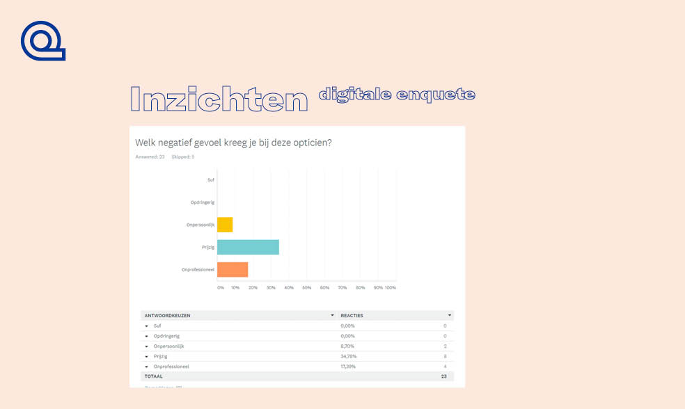
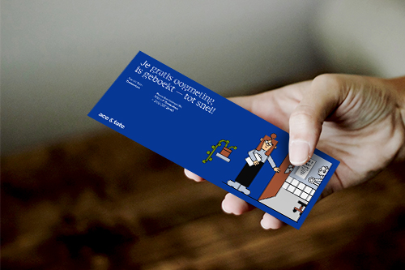

<!doctype html>
<html class="no-js" lang="zxx">
  <head>
    <meta charset="utf-8">
    <meta http-equiv="x-ua-compatible" content="ie=edge">
    <title>CLIQ</title>
    <link rel="icon" href="images/cliqLogo.png">
    <meta name="description" content="">
    <meta name="viewport" content="width=device-width, initial-scale=1">

    <link rel="apple-touch-icon" href="apple-touch-icon.png">
    <!-- Place favicon.ico in the root directory -->

    <link rel="stylesheet" href="plugins/bootstrap/bootstrap.min.css">
    <!-- ThemeFisher Icon -->
    <link rel="stylesheet" href="plugins/themefisher-fonts/themefisher-fonts.css">
    <!-- Light Box -->
    <link rel="stylesheet" href="plugins/magnific-popup/magnific-popup.css">
    <!-- animation css -->
    <link rel="stylesheet" href="plugins/animate/animate.css">
    <!-- slick slider -->
    <link rel="stylesheet" href="plugins/slick/slick.css">
    <!-- Flickity carousel slider -->
    <link rel="stylesheet" href="https://unpkg.com/flickity@2.2.1/dist/flickity.css">
    <!-- Revolution Slider -->
    <link rel="stylesheet" href="css/style.css">

    
    
    
  </head>
  <body>
    <!--[if lt IE 8]>
      
You are using an <strong>outdated</strong> browser. Please <a href="http://browsehappy.com/">upgrade your browser</a> to improve your experience.

    <![endif]-->

  <!-- Loader to display before content Load-->
  

    <!--  -->

    

      

        

      

      

        

      

      

        

      

      

        

      

      

        

      

    

  
 

 <!-- Navigation -section
  =========================--> 
<!-- <nav class="navbar navbar-fixed-top navigation" >
  

     Brand and toggle get grouped for better mobile display 
    

      <button type="button" class="navbar-toggle" data-toggle="collapse" data-target=".navbar-ex1-collapse">
        Toggle navigation
        
        
        
      </button>
      
    

     Collect the nav links, forms, and other content for toggling 
    

      <ul class="nav navbar-nav navbar-right menu">
        <li><a href="index.html">Home</a></li>
        <li><a href="services.html">Service</a></li>
        <li><a href="portfolio.html">Portfolio</a></li>
        <li><a href="blog.html">Blog</a></li>
        <li><a href="contact.html">Contact</a></li>
      </ul>
    
 /.navbar-collapse
  

</nav> -->

<!-- Hero Area -section
  =========================-->
    <header class="hero-area th-fullpage" data-parallax="scroll">
      

        <video preload="true" autoplay muted loop id="myVid">
          <source src="images/headerVid.mp4" type="video/mp4" >
        </video>
      

      
    

  </header>

 <!-- Intro section
  =========================-->

  <section class="case-study">
    

      <h2 class="inner-title"><i>"Design a meaningful   ‘phygital’ brand-experience   for a retail brand."</i></h2>
    

    <!-- Intro Description
      top section -->
    

      

        

          

            

              
Tijdens de minor User Interface & User Experience Design hebben wij gewerkt voor <b>van Berlo</b>. 
                Zij gaven ons de opdracht om de huidige winkel ervaring te verbeteren in fysieke winkels. Hiervoor hebben wij een merk moeten kiezen, 
                die wij gepast vonden voor deze opdracht en die bij de merk identiteit van <b>CLIQ</b> past. De keuze is uiteindelijk gegaan naar <b>Ace&tate</b>, 
                een echte opticien voor de 21e eeuw.  <b>Ace&tate</b> is een echte game-changer in de brillenwereld en biedt kwalitatief, modieuze en zeker betaalbare monturen aan, 
                aan een brede doelgroep. Mark de Lange, CEO, begon zijn bedrijf op het internet maar merkte al snel dat zijn merk fysieke winkels nodig heeft om op terug te vallen. 
                Een innovatief bedrijf, maar hoe behouden ze de huidige populariteit in een steeds erger concurrerendere markt?
              

            

          

          

            

              

                Na een uitgebreid onderzoek naar het merk <b>Ace&tate</b>, de doelgroep aandachtig te hebben bekeken en een oplossing te zoeken in het phygitale domein zijn wij met een oplossing gekomen voor de problemen van <b>Ace&tate</b>. Want ook populaire merken hebben wel eens last van problemen.
                 Onze oplossing is… een spiegel. Maar niet zomaar een spiegel, een die volledig aansluit op de wensen van de doelgroep. Op deze website leggen wij meer uit over dit innoverende product en de weg die wij hiervoor hebben afgelegd.
                 Veel leesplezier!  
                - team <b>CLIQ</b>

            

          

        

      

    

<!-- Flickity HTML init -->

  

  

  

    <!-- Case Study Description
      bottom section -->
    

      

        

          <h2 class="inner-title"><i>Research</i></h2>
        

        
 
          

            <!-- inner sub-title -->
            

              

                  Toen het merk vast was gesteld zijn wij begonnen met het maken van een stakeholder map. Door verschillende betrokken partijen vast te stellen rondom Ace&tate konden wij 
                  als team gerichter aan de slag gaan met het onderzoek. Zo werd als snel duidelijk met welke werknemers van Ace&tate wij eventueel te maken zouden hebben, naar welke concurrenten 
                  wij kunnen kijken en natuurlijk met welke doelgroep wij te maken zouden krijgen.
              

             
              

                Naast de stakeholdermap hebben wij vrij snel een customer journey opgesteld die het aankoopproces van een montuur bij Ace&tate inzichtelijk maakte. Ondanks deze customer journey tot zover nog gebaseerd was op aannames, zorgde deze er wel voor dat wij ons konden focussen op de juiste momenten voor de klant en gericht onderzoek konden doen.
            

            

          

          

            

              
            

          

        

        <!-- End of row -->
        

           
            

            

                Na deze eerste stappen hebben we gekeken naar de intenties van Ace&tate. Welke visie hebben zij,  wat is het huidige verdienmodel, wat is de huidige merkbeleving en welke content strategie houden zij aan.
            

            

             
        

        <!-- End of row -->
        
 
            

              
            

        

        <!-- End of row -->

        
 
          

            

              
            

          

          

            <!-- inner sub-title -->
            

              

                Ook hebben we de doelgroep verder onder de loep genomen. Door met de doelgroep in gesprek te gaan hebben wij een realistischere customer journey kunnen opstellen en hebben we de doelgroep kunnen opdelen in drie verschillende persona’s met elk andere behoeften en pijnpunten bij het merk.
            

            

          

        

        <!-- End of row -->
    

    

  

</section>

  

    
  

  

    
  

  

    
  

  <!-- Flickity HTML init -->
  

  

  

  

  

  

    

      

          

          

              Aan de hand van het onderzoek zijn wij met drie verschillende concepten gekomen die de pijnpunten van de doelgroep moeten oplossen. 
          

          

      

      <!-- End of row -->
  

  

</section>

<!-- Clients Sections
=========================-->
<section class="clients">
  

    

      

        

          

            <h2 class="inner-title"><i>Concepten</i></h2>
          

          

              

                <!-- Slider item -->
                <!-- 
 -->
                

                  <h2 class="title" style="color: rgb(007, 053, 147);"><b>Space & tate</b></h2>
                  <!-- 

 -->
                  
Het concept Space & Tate staan in het kader van een oplossing vinden in de publieke ruimte. Uit de interviews die zijn gehouden met de doelgroep is gebleken dat Ace & Tate minder bekend is dan in eerste instantie was gedacht.  Door een extra touchpoint te creëren buiten de muren van Ace & Tate wordt de customer journey aan zowel de voorkant als achterkant verlengd. Dit zal enerzijds de bekendheid van het merk verhogen door een nieuwe doelgroep aan te spreken maar kan ook resulteren in een verbeterd groepsgevoel binnen de gevestigde klantenkring.
                     Deze visualisatie laat een photobooth zien die een potentiele doelgroep in aanraking brengt met het merk Ace & Tate. Door gratis foto’s aan te bieden worden de gebruikers naar binnen gelokt waar een fotoreeks wordt gemaakt. In combinatie met de bestaande virtual try-on van Ace & Tate worden naderhand de verschillende brilmonturen van Ace & Tate aan de foto’s toegevoegd. Op de fotoreeks die de gebruikers naderhand ontvangen zien zij deze kleine verassing, onder de foto’s worden de brilmonturen beschreven om de kennis van de toekomstige klant te vergroten.  Omdat de fotoreeks een fysiek product is die gekoppeld is met een fijne ervaring kan dit uiteindelijk ook resulteren in een versterkt groepsgevoel onder de klantenkring, op dezelfde manier als de totebags dit doen.
                  

                  
                

                <!-- 
 -->
                <!-- End Slider item -->
              

          

          <!-- End first concept-->
          

            

              <!-- Slider item -->
              <!-- 
 -->
              

                <h2 class="title" style="color: #fff;"><b>Personal Mirror</b></h2>
                <!-- 

 -->
                
Binnen dit concept is er gekeken naar een oplossing binnen de context van de winkel voor de problemen van de doelgroep. Binnen de context van de fysieke winkel is een phygital product in combinatie met de spiegels een subtiele toevoeging.

                   Uit de discovery fase is gebleken dat de doelgroep problemen ervaart met de persoonlijke hulp binnen de winkel. Dit komt door een verkeerde verwachting van de klant naar de werkwijze van het winkelpersoneel, waardoor het óf te nonchalant/ arrogant overkomt óf juist te overdreven hulpzaam. De wortel van dit probleem ligt bij het feit dat de consumenten verdeeld kunnen worden in twee groepen: de hulpbehoevende klanten die persoonlijk door het koopproces begeleidt moet worden én de zelfstandige klanten die graag hun eigen pad trekken door het koopproces.
                  
                   Met de Personal Mirror willen wij een nieuw touchpoint creëren binnen de huidige Customer Journey die op een persoonlijke manier de klanten met een zelfstandig koopgedrag aanspreken. 
                   
                   De vernieuwde spiegels zullen na activering, door bijvoorbeeld een motion sensor, de klant te woord staan. Dit betekend dat bij het passen van verschillende monturen er extra informatie wordt verschaft aan de klant. De spiegels zullen deze monturen binnen de winkel herkennen door bijvoorbeeld RIFD chips in de brillen, om zo de juiste informatie bij de juiste monturen te geven.
                

                
              

              <!-- 
 -->
              <!-- End Slider item -->
            

          

          <!-- End second concept-->
          

            

              <!-- Slider item -->
              <!-- 
 -->
              

                <h2 class="title" style="color: rgb(007, 053, 147);"><b>Interactive Screens</b></h2>
                <!-- 

 -->
                
Interactive screens, deze spelen in op de voorbeleving van het merk bij de klant. Door de ligging van de fysieke winkels en de huidige marketingstrategie van Ace&tate zijn zij niet altijd bekend bij de diverse doelgroep. Door interactieve schermen te plaatsen in de binnenstad komen potentiele klanten al eerder in contact met het merk, in detail is de bedoeling dat deze schermen de doelgroep al snel een voorstel doet van een montuur die bij de gebruiker past.
                

                
              

              <!-- 
 -->
              <!-- End Slider item -->
            

          

        

      
<!-- /.End row -->
    

  

</section>

<section class="section" style="background-color: rgb(007, 053, 147)">
  

    <h4 class="title" style="padding-top: 30px; text-align: center;"><i>Dit concept is gebaseerd op een aantal pijnpunten die de gebruikers binnen de
      user experience hebben ondervonden.  De oplossing gaat zich in de context van
      de fysieke winkel bevinden en zal een “phygital” product worden.  Dat betekend
      dat het een combinatie word van een fysiek en digitaal product.</i></h4>
  

  

      

        

          

            <h4 class="case-description">Pijnpunt 1 - Benadering klanten</h4>
            
Uit de discovery fase is gebleken dat de doelgroep zich niet gezien voelt door
              het personeel. Dit komt voort uit de benadering van het personeel naar de
              klanten toe. Vaak worden klanten niet of te laat begroet door het personeel.
              Daarnaast duurt het relatief lang voordat het personeel naar de klant toe stapt,
              om deze hulp aan te bieden.

          

        

        

          

            <h4 class="case-description">Pijnpunt 2 - Slechte service</h4>
            
De houding van Ace & Tate naar hun klanten toe word beschreven als
              nonchalant, toegankelijk en laagdrempelig. Maar in realiteit word het door de
              klanten meer geïnterpreteerd als arrogant en onvriendelijk.

          

        

      

    

    

      

        

          

            <h4 class="case-description">Pijnpunt 3 - Gebrek aan kennis van personeel</h4>
            
Het personeel dat in de winkel staat blijkt een gebrek aan optische kennis te
              hebben en kan alleen maar advies geven over hoe de bril bij de klant staat. De
              optische kennis blijkt alleen bij de opticien te zijn die de oogmetingen doet. Het
              probleem hiervan is dat hij/zij alleen in het kamer zit waar de metingen worden
              gedaan. Daardoor is er in de winkel geen aanspreekpunt voor optische vragen.
              Dit resulteert in een negatief beeld van het merk, omdat de klant nergens met
              deze vragen in de winkel terecht kan. Behalve als deze een afspraak heeft gemaakt om zijn/haar ogen op te meten.

          

        

        

          

            <h4 class="case-description">Pijnpunt 4 - Slechte communicatie intern</h4>
            
Meerdere klanten hebben aangegeven dat er veel steken worden laten vallen
              tijdens de interne communicatie tussen het personeel. Bij veranderingen van
              bestellingen die handmatig moeten worden doorgevoerd, blijkt het grotendeels
              fout te gaan of niet eens gedaan te worden. Dit resulteert in frustratie bij de
              klant en een onnodig lang aankoopproces.

          

        

      

    

  

</section>

  <video preload="true" id="myVid" controls style="width: 100%;">
    <source src="images/headerVid.mp4" type="video/mp4" >
  </video>

  

<!-- Iteraties -->

  

    

      <h1 class="inner-title"><i>MIRROR</i></h1>
    

      

        <h4 style="padding-top: 30px; text-align: center; color: #000;"><i>Om de bovenstaande pijnpunten te grotendeels te verhelpen zijn we
          opgekomen met een “phygital” product dat de klanten tijdens hun
          aankoopproces zal ondersteunen. Dit gaan we realiseren in de vorm van een
          “Personal Mirror”.</i></h4>
      

    

    
 
      

        <!-- inner sub-title -->
        

          
Wanneer de klant de winkel binnenstapt word hij/zij opgemerkt door een motion
            detector. Bij de ingang van de winkel staat er een beeldscherm die klant
            begroet en laat weten dat er een personal mirror aanwezig is in de store. Dit
            word gecommuniceerd naar de klant door middel van tekst op het
            beeldscherm.

             
            
Zodra de klant bij de “personal mirror” aankomt, word deze opgemerkt door
              een “motion detector”, ook hier word de klant begroet door middel van een
              tekstuele begroeting op het scherm.

             
            
De “personal mirror” kan de klant 2 soorten service verlenen: een uitgebreide
              service voor klanten die nog geen idee hebben wat ze willen en een kortere
              service waarin de klant wel al weet wat hij/zij precies wilt.
              De spiegel laat de klant als eerst kiezen tussen welke service ze nodig heeft.

        

      

      

        

          
        

      

    

    
 
      

        <!-- inner sub-title -->
        

          
        

      

      

        

          
Aan de hand van 3 factoren geeft de spiegel een advies van 3 monturen die het
            beste bij de klant passen. Deze aspecten zijn: levensstijl, kledingstijl en vorm
            van het gezicht. De spiegel gaat 1 voor 1 deze factoren langs en stelt de
            gebruiker vragen om tot conclusie te komen. Wanneer de spiegel alle vragen
            heeft gesteld, word er een advies gegeven van 3 verschillende monturen.

           
          
De service van de spiegel eindigt met het advies van de 3 monturen. Dit advies
            word op een fysieke “token” uitgeprint, die de gebruiker bij de spiegel gelijk
            meekrijgt. Met deze “token” kan de gebruiker naar een medewerker in de
            winkel lopen. Op deze “token” kan de uitkomst van de 3 factoren benoemd worden,
            samen met het advies van de 3 monturen.

             
            
Om de service af te ronden loopt de klant naar een medewerker toe in de store.
              De medewerker zal samen met de klant de resultaten doornemen en geeft
              vervolgens persoonlijk aanvullend advies over de 3 monturen.
              Hierna zal de medewerker de klant door de rest van het koopproces
              meenemen.

               
              
Op de fysieke token die de klant heeft meegekregen staat een code of hashtag.
                Deze kan de klant gebruiken voor het plaatsen van een foto op socialmedia.

        

      

    

    
 
      

        <!-- inner sub-title -->
        

          
Visueel 
            Voor het ontwerp van de interface hebben we een aantal iteraties gedaan. 
            Zo zijn we begonnen met een ontwerp die gebaseerd was op aannames. 
            Visuele stijl elementen die wij als functioneel ervaren voor een interactieve spiegel, waarbij we ook gekeken hebben naar de tone of voice en waarden van Ace & Tate. 
            Aan het begin waren de ontwerpen heel digitaal en futuristisch, iets wat meer weg had van een HUD uit een videospel. 
            Uit een iteratie is bijvoorbeeld voort gekomen dat de interface te futuristisch was en helemaal niet bij Ace & Tate past. 
            Die feedback hebben we meegenomen om tot het ontwerp te komen waar we nu zijn. 
            Daarnaast waren er teveel visuele elementen gebruikt, wat de leesbaarheid ook niet ten goede deed. 
            Dit komt omdat ontwerpen voor een spiegel voor ons ook nieuw was en we ineens rekening moesten houden met weerspiegelingen.

        

      

      

        

          
        

      

    

    
 
      

        <!-- inner sub-title -->
        

          
        

      

      

        

          
Gebruik 
            De manier waarop de gebruiker de interactie aan gaat met de spiegel is ook iets wat we getest hebben. 
            Uit onderzoek bleek dat het werken met een touchscreen niet ideaal is. 
            Vingerafdrukken op een spiegel blijven altijd goed zichtbaar, waardoor zowel de interface als de persoon in de spiegel het zicht belemmerd kan worden. 
            Werken met gestures is uiteindelijk waar we voor gekozen hebben. 
            Omdat er een aantal gestures zijn en het gebruik van de spiegel een aantal minuten kan duren kan het zijn dat de gebruiker niet meer weet welke gestures nodig zijn om een bepaald doel te bereiken. 
            Hier hebben we ook een oplossing voor bedacht door een sticker te maken de op de spiegel geplakt kan worden. 
            Hierop is een soort “How to use” te vinden die altijd zichtbaar is wanneer de gebruiker de interactie aan gaat met de spiegel.

        

      

    

</section>

  <!--  Clients Logo Sections
  =========================
  <section class="clients-logo" data-parallax="scroll" data-image-src="images/slider/bg-1.jpg">
    

      

        

          

            
          

          

            
          

          

            
          

        
          

            
          

          

            
          

          

            
          

        
 /.End row 
      

    

  </section> -->

  <!-- Team Sections
  =========================-->
  <section class="team">
    

    <!-- Team title -->
    

      <h2>Team CLIQ</h2>
    

    

        

            

              

                

                  
                

                

                  

                    <h4>Stef Rullens</h4>
                    Interaction Design
                    
21 jaar / 4e jaars Communicatie en Multimedia Design
                        / Afgelopen half jaar stage gelopen bij PanArt waar ik
                        vooral op het visuele heb gefocust. Ik zal mij focussen op
                        het gebied van Interaction Design. Dit houdt in dat ik mij
                        bezig ga houden met de gebruiksvriendelijkheid van het
                        product ten opzichten van de toekomstige gebruiker.Mijn
                        uiteindelijke doel bij dit project is om iets neer te zetten
                        waar we allemaal met trots op kunnen terugkijken en wat
                        een daadwerkelijk positieve invloed heeft op jullie bedrijf.

                    
                  

                

              

            

          

          
          

              

                

                  

                    
                  

                  

                    

                      <h4>Tristan Roeleveld</h4>
                      Research/Commercieel
                      
22 jaar Grafisch/Commerciële Economie Creative
                          marketing and Sales. Eigenaar geengehoor en mede
                          eigenaar activefloor Nederland. Ik ben verantwoordelijk
                          voor Research/Commercieel. Een omgeving creëren
                          doormiddel van goed onderzoek met niet alleen een
                          functionele gedachtegang, maar ook commerciële. Ik
                          wil meer de diepte in kunnen duiken met alles betreft
                          interface design en de koppeling vinden tussen de
                          “commerciële wereld” en “vrije wereld” voor mezelf, zodat
                          ik een brede kennis praktisch in kan zetten.

                      
                    

                  

                

              

            

            

                

                  

                    

                      
                    

                    

                      

                        <h4>Charlie Souisa</h4>
                        Visual Designer
                        
25 jaar. Ik heb 6 maanden lang stage gelopen bij ontwikkel
                            bureau YipYip, ik ben daar werkzaam geweest als visual
                            design stagiaire. Ik heb daar veel kunnen leren over
                            verhoudingen, gebruiksvriendelijkheid en samenhangende
                            designs. Mijn taak dit project is Visual designer. Ik zal de
                            eindverantwoordelijke zijn op het gebied van al het visuele
                            ontwerp dit project. Ik wil mijzelf als ontwerper verder
                            ontwikkelen en mijn skills om de gebruiksvriendelijkheid
                            van een interactief product te complimenteren door
                            middel van het visuele ontwerp verbeteren.

                        
                      

                    

                  

                

              

              

                  

                    

                      

                        
                      

                      

                        

                          <h4>Vincent van der Spelt</h4>
                          Prototyper
                          
20 jaar / 4e jaars Informatica / Eerste helft vorig jaar stage
                              gelopen bij Axians waar ik me gefocust heb op Progressive
                              Web Apps, 2e helft minor Cyber Security gevolgd.
                              Tijdens dit project ben ik verantwoordelijk voor het
                              Prototypen aangezien dit binnen mijn vakgebied ligt.
                              Omdat we een fysiek iets gaan maken ligt het een
                              beetje buiten mijn comfort-zone aangezien dit meer
                              richting technische informatica gaat maar dit lijkt me
                              juist een leuke uitdaging. Mijn doel tijdens dit project is
                              verantwoordelijkheid nemen over mijn domein.

                          
                        

                      

                    

                  

                

                

                    

                        

                          
                        

                        

                          

                            <h4>Calvin Tentua</h4>
                            Concepting/Research
                            
25 jaar. Comunicatie en Multimedia Design. Afgelopen
                                half jaar stage gelopen bij Dailymilk als UI/UX ontwerper.
                                Mijn taak is Concepting/Research. Voorheen vooral
                                bezig geweest met visueel design, nu wil ik mij meer
                                ontwikkelen op het gebied van onderzoek en aan de hand
                                van de resultaten goede concepten neer zetten. Ik wil
                                me vooral ontwikkelen op het gebied van onderzoek en
                                concepting. Daarnaast wil ik een goed project neerzetten
                                met het team, waar zowel de opdrachtgever als het merk
                                waar we voor aan de slag gaan iets aan heeft.
                                Ons team is bewust samengesteld om zo breed
                                mogelijk scala aan skills te benutten. Binnen ons team
                                hebben we 3 verschillende opleidingen, maar ook de
                                verantwoordelijkheden breed verdeeld om alles te dekken.
                                Hierdoor kan iedereen zijn specialisme benutten zonder
                                zich druk te maken over de rest.
                                

                            
                          

                        

                    

                  

        

    

    

  </section>

<!-- Contact Us Sections
=========================-->
<!-- <section class="contact-call-to-action">
  

    

      

        

          

            <h2>Get In Touch</h2>
            
Lorem ipsum dolor sit amet, consectetur adipisicing elit. Libero fugiat cum ad officia, harum, et
              voluptas quia vel voluptatem aliquam, facilis corporis nam tempore ullam doloribus iusto sequi ipsum.
              Fugiat non culpa ad beatae sed dolorem doloribus accusamus

            <a class="btn btn-default btn-main" href="#" role="button">Contact Us</a>
          

        

      

    

  

  

</section> -->

    <footer class="footer">
        

            

                

                    

                        

                            <!-- footer About section
                            ========================== -->
                            

                                <h3 class="footer-title">About</h3>
                                
Deze site is gemaakt door team CLIQ  
                                    voor de minor UIX-design op Hogeschool Rotterdam

                            

                        

                        

                            <!-- footer Address section
                            ========================== -->
                            

                                <h3 class="footer-title">Address</h3>
                                
Wijnhaven 103, Rotterdam, Nederland

                            

                        

                   

                    

                    

                    

                        

                            

                                
&copy; 2019-2020 
                                    Developed By <a href="https://3.basecamp.com/4250144/projects/13585424" target="_blank" style="color: rgb(007, 053, 147)">CLIQ</a>

                            

                        

                    

                

            

        

    </footer>

    

    
    <!-- slick slider -->
    
    <!-- filter -->
    
    <!-- Lightbox -->
    
    <!-- Parallax -->
    
    <!-- Video -->
    
    <!-- google map -->
    
    

    
    </body>

    </html>
